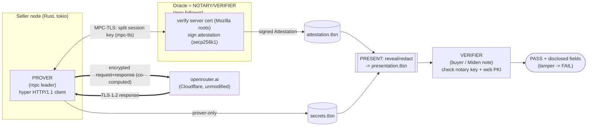

# BARTOK zkTLS — stack & component diagram (Phase 1)

This is the verification layer only (proving a model call really happened, on the claimed model,
for N tokens, without leaking the key or content). Settlement on Miden is the next phase.

## Exact stack

| Layer | What we use | Notes |
|---|---|---|
| Language / runtime | **Rust 1.95**, **tokio** 1.52 (async) | the seller node + oracle are Rust services |
| zkTLS protocol | **TLSNotary v0.1.0-alpha.15** (`tlsn` umbrella crate) | open-source, self-hostable, server needs no cooperation |
| TLS-in-2PC engine | **`mpc-tls`** | prover = MPC **leader**, notary = MPC **follower**; the TLS session key is split so the prover alone cannot forge the transcript |
| HTTP framing / commitments | **`tlsn-formats`** (`HttpTranscript`, `DefaultHttpCommitter`) | parses the HTTP/1.1 transcript and commits its parts (headers / body / JSON fields) so they can be revealed or redacted individually |
| Signatures | **`k256`** (secp256k1 ECDSA — `Secp256k1Signer` / `VerifyingKey`) | the notary's attestation signature; pairing-free → maps to the oracle's later **RPO Falcon-512** re-sign for Miden |
| Server cert trust | **`rustls-webpki`** + **`webpki-root-certs`** (Mozilla roots) | both the prover and the notary verify openrouter.ai's real cert chain |
| HTTP client | **`hyper`** (http1) + **`http-body-util`** | HTTP/1.1 with `Connection: close` (TLSNotary needs no compression / no h2) |
| Serialization | **`bincode`** (artifacts), **`serde_json`** (read model/usage) | |
| Target server | **openrouter.ai** (Cloudflare-fronted, unmodified) | OpenAI-compatible REST; TLS 1.2 path works |
| Our code | `tlsn/crates/examples/openrouter/{prove,present,verify}.rs`, `test-zktls.sh` | |
| Artifacts | `*.attestation.tlsn` (signed), `*.secrets.tlsn` (prover-only), `*.presentation.tlsn` (redacted, shareable) | |

## Roles → BARTOK mapping

| zkTLS role | BARTOK role |
|---|---|
| **Prover** (mpc leader) | the **seller's node** (runs the prompt on its own AI access) |
| **Notary / Verifier** (mpc follower, signs) | the **oracle** (in-process & local for the spike; independent / threshold set in prod) |
| **Server** | the **model API** (here openrouter.ai) |
| **Verifier** (checks presentation) | the **buyer**, and later the **Miden settlement note** |

## Component diagram



## Three phases (sequence)

```mermaid
sequenceDiagram
  participant P as PROVER (seller)
  participant N as NOTARY/VERIFIER (oracle)
  participant API as openrouter.ai
  participant V as VERIFIER (buyer / Miden)

  Note over P,N: 1. NOTARIZE — MPC-TLS, session key is split
  P->>N: establish MPC-TLS session
  P->>API: HTTPS POST /api/v1/chat/completions (Bearer key, model, max_tokens)
  API->>P: HTTPS 200 (model, usage, answer)
  N->>N: verify server cert vs Mozilla roots
  N-->>P: signed Attestation (secp256k1)  -> attestation.tlsn + secrets.tlsn

  Note over P: 2. PRESENT (local, prover only)
  P->>P: choose reveal/redact -> presentation.tlsn
  Note right of P: reveal endpoint, req model+max_tokens, resp model+usage;<br/>redact Authorization (key), prompt, answer

  Note over P,V: 3. VERIFY (anyone)
  P->>V: presentation.tlsn
  V->>V: check notary pubkey + web PKI
  V-->>V: PASS (shows disclosed fields, redacted = X) / FAIL on tamper
```

## ASCII (same thing, terminal-friendly)

```
  SELLER NODE (Rust)                    ORACLE (notary)                 INTERNET
  ┌───────────────────┐   mpc-tls 2PC  ┌──────────────────┐
  │ PROVER (leader)   │◄══ split key ═►│ NOTARY (follower)│
  │ hyper HTTP/1.1    │                │ verify cert      │      ┌──────────────┐
  │                   │════ encrypted request+response ═══╪═════►│ openrouter.ai│
  │                   │◄═══════════════════════════════════╪═════│ (Cloudflare) │
  │ transcript(plain) │                │ sign secp256k1   │      └──────────────┘
  └─────────┬─────────┘                └────────┬─────────┘
            │ commit (tlsn-formats)             │
            ▼                                    ▼
      secrets.tlsn  ◄──────────────────  attestation.tlsn (signed)
            │                                    │
            └──────────────► PRESENT ◄───────────┘
                     reveal model/max_tokens/usage
                     redact key + prompt + answer
                              │
                              ▼
                       presentation.tlsn ──► VERIFY (buyer / Miden note)
                                              checks notary key + web PKI
                                              PASS + fields | tamper → FAIL
```

## Why it can't be faked (the crypto, briefly)
- **MPC-TLS**: the TLS session key is jointly held by prover + notary, so the prover cannot fabricate
  a transcript after the fact — the notary co-authenticated the bytes live.
- **Server cert**: checked against the real Mozilla root set, so "from openrouter.ai" is real provenance.
- **Selective disclosure**: each transcript part is committed; the presentation reveals chosen parts and
  proves the rest exists without showing it (redacted = X). Editing any byte breaks verification.
- **Trust assumption (current)**: one local notary key. Prod hardening = independent oracle, then a
  threshold (k-of-n) set; on Miden the notary's role is re-signed as RPO Falcon-512 and verified in-VM.
```
